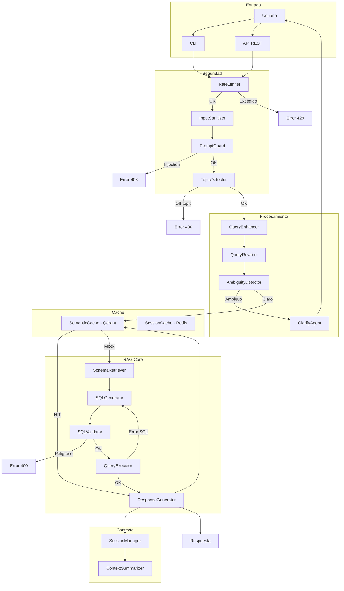
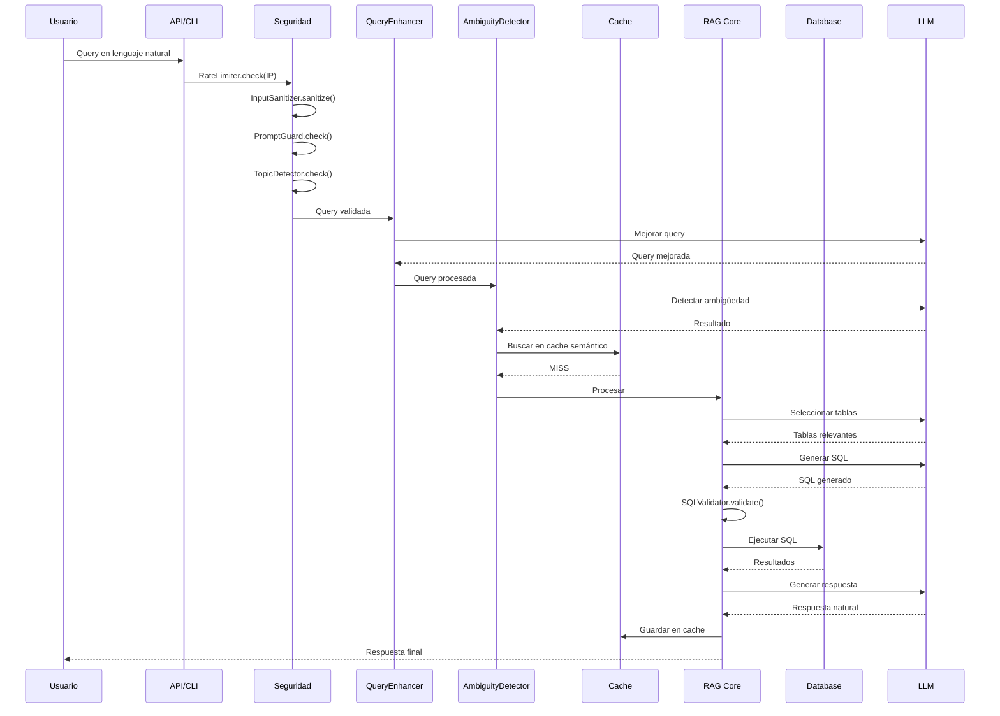

# Flujo de Procesamiento RAG-SQL

## Descripción

RAG-SQL implementa Retrieval-Augmented Generation especializado en bases de datos:

- **Retrieval**: Recupera schemas de tablas relevantes para la consulta
- **Augmented**: Aumenta el contexto del LLM con metadatos de la DB
- **Generation**: Genera SQL y respuestas en lenguaje natural

---

## Diagrama de Flujo



---

## Secuencia de Procesamiento



---

## Componentes y Uso de LLM

| Componente | Función | Usa LLM |
|------------|---------|:-------:|
| InputSanitizer | Limpia caracteres peligrosos | No |
| PromptGuard | Detecta prompt injection | No |
| TopicDetector | Verifica tema de DB | Sí |
| QueryEnhancer | Mejora redacción | Sí |
| AmbiguityDetector | Detecta ambigüedad | Sí |
| ClarifyAgent | Genera opciones de clarificación | Sí |
| SchemaRetriever | Selecciona tablas relevantes | Sí |
| SQLGenerator | Genera SQL | Sí |
| SQLValidator | Valida seguridad SQL | No |
| QueryExecutor | Ejecuta en DB | No |
| ResponseGenerator | Genera respuesta natural | Sí |

---

## Consumo de Tokens por Query

| Componente | Input | Output | Total |
|------------|------:|-------:|------:|
| QueryEnhancer | ~200 | ~50 | 250 |
| AmbiguityDetector | ~300 | ~50 | 350 |
| SchemaRetriever | ~500 | ~100 | 600 |
| SQLGenerator | ~800 | ~200 | 1000 |
| ResponseGenerator | ~600 | ~300 | 900 |
| **Total por query** | **2400** | **700** | **~3100** |

Costo estimado: ~$0.001 USD por query (Deepseek)

---

## Ejemplos de Uso

### Health Check
```bash
curl http://localhost:8000/health
```

### Health Detallado
```bash
curl http://localhost:8000/health/detailed
```

### Información del Sistema
```bash
curl http://localhost:8000/info
```

### Ejecutar Consulta
```bash
curl -X POST http://localhost:8000/query \
  -H "Content-Type: application/json" \
  -d '{"query": "¿Cuántos usuarios hay?"}'
```

### Consulta con Streaming
```bash
curl -X POST http://localhost:8000/query/stream \
  -H "Content-Type: application/json" \
  -d '{"query": "Lista los productos más vendidos"}'
```

### Crear Sesión
```bash
curl -X POST http://localhost:8000/session
```

### Query con Contexto de Sesión
```bash
curl -X POST http://localhost:8000/query \
  -H "Content-Type: application/json" \
  -d '{"query": "¿Y cuántos son activos?", "session_id": "abc123"}'
```

### Métricas JSON
```bash
curl http://localhost:8000/metrics
```

### Métricas Prometheus
```bash
curl http://localhost:8000/metrics/prometheus
```

---

## Métricas Disponibles

| Métrica | Tipo | Descripción |
|---------|------|-------------|
| `ragsql_requests_total` | Counter | Total de requests por endpoint |
| `ragsql_queries_total` | Counter | Queries procesadas |
| `ragsql_cache_hits_total` | Counter | Hits en cache semántico |
| `ragsql_cache_misses_total` | Counter | Misses en cache |
| `ragsql_security_blocks_total` | Counter | Bloqueos por seguridad |
| `ragsql_pipeline_duration_avg_ms` | Gauge | Latencia promedio |
| `ragsql_pipeline_duration_p95_ms` | Gauge | Latencia percentil 95 |
| `ragsql_active_sessions` | Gauge | Sesiones activas |
| `ragsql_tables_indexed` | Gauge | Tablas indexadas |
