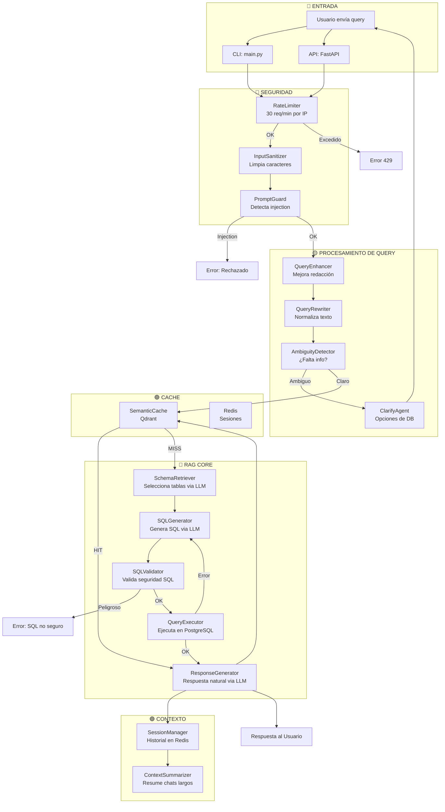
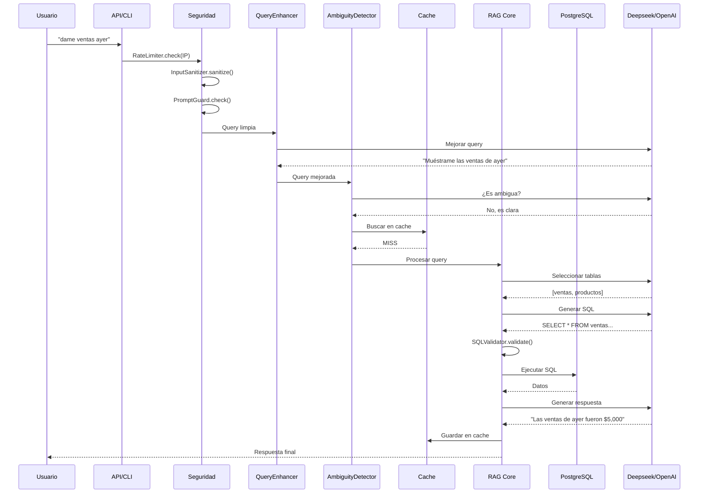
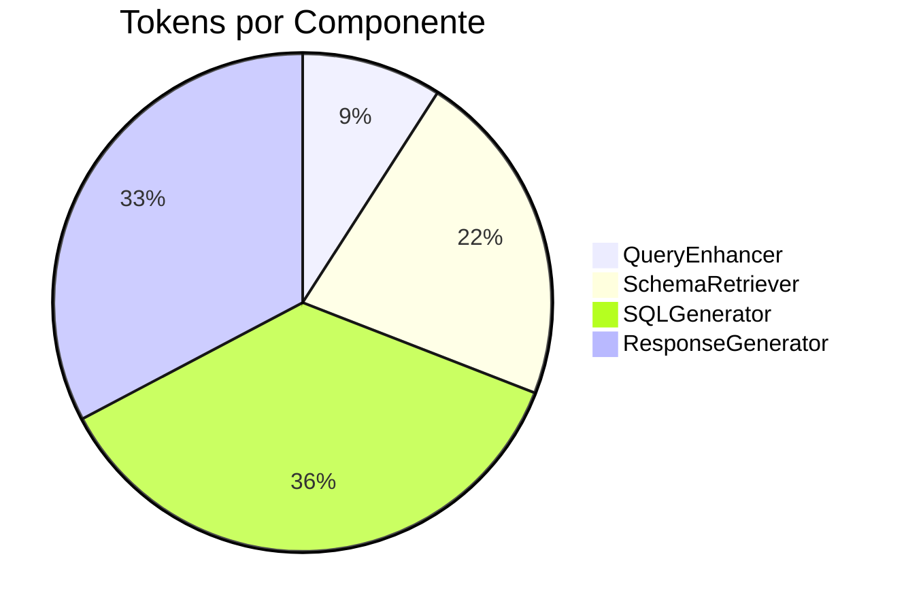

# 🔷 RAG-SQL - Flujo Principal

## Diagrama de Flujo Completo

---

## Flujo Detallado Paso a Paso

---

## Comparación: Antes vs Después

| Componente | Versión Anterior | Versión Actual | Estado |
|------------|------------------|----------------|--------|
| QueryEnhancer | ❌ No existía | ✅ `query_enhancer.py` | **NUEVO** |
| QueryRewriter | ✅ `query_rewriter.py` | ✅ `query_rewriter.py` | ✅ |
| AmbiguityDetector | ✅ `ambiguity_detector.py` | ✅ `ambiguity_detector.py` | ✅ |
| ClarifyAgent | ✅ `clarify_agent.py` | ✅ `clarify_agent.py` | ✅ |
| ContextSummarizer | ✅ `context_summarizer.py` | ✅ `context_summarizer.py` | ✅ |
| SessionManager | ✅ `session_manager.py` | ✅ `session_manager.py` | ✅ |
| SQLValidator | ✅ `sql_validator.py` | ✅ `security.py` | ✅ Consolidado |
| PromptGuard | ✅ `prompt_guard.py` | ✅ `security.py` | ✅ Consolidado |
| InputSanitizer | ✅ `input_sanitizer.py` | ✅ `security.py` | ✅ Consolidado |
| SensitiveDataGuard | ✅ `sensitive_data_guard.py` | ✅ `security.py` | ✅ Consolidado |
| RateLimiter | ✅ `rate_limiter.py` | ✅ `rate_limiter.py` | ✅ |
| LLMThrottler | ✅ `llm_throttler.py` | ✅ `rate_limiter.py` | ✅ Consolidado |
| AuditLogger | ✅ `audit_logger.py` | ❌ Removido | ⚠️ Opcional |
| SemanticCache | ✅ `semantic_cache.py` | ✅ `qdrant_cache.py` | ✅ |
| QueryCache (Redis) | ✅ `query_cache.py` | ❌ Removido | ⚠️ Usamos SemanticCache |

### Resumen:
- ✅ **0 componentes perdidos** de lógica crítica
- ✅ **1 componente nuevo**: QueryEnhancer
- ⚠️ **2 opcionales removidos**: AuditLogger, QueryCache (Redis simple)
- ✅ **4 consolidados en security.py**: más limpio y mantenible

---

## Uso de Tokens por Llamada LLM

| Componente | Input Tokens | Output Tokens | Total |
|------------|-------------|---------------|-------|
| QueryEnhancer | ~200 | ~50 | 250 |
| AmbiguityDetector | ~300 | ~50 | 350 |
| SchemaRetriever | ~500 | ~100 | 600 |
| SQLGenerator | ~800 | ~200 | 1000 |
| ResponseGenerator | ~600 | ~300 | 900 |
| **TOTAL por query** | **2400** | **700** | **~3100** |

**Costo estimado por query**: ~$0.001 USD (Deepseek)
