# 🔷 RAG-SQL - Flujo Principal

## Diagrama de Flujo Completo

---

## Flujo Detallado Paso a Paso

```mermaid
sequenceDiagram
    participant U as Usuario
    participant API as API/CLI
    participant SEC as Seguridad
    participant ENH as QueryEnhancer
    participant AMB as AmbiguityDetector
    participant CAC as Cache
    participant RAG as RAG Core
    participant DB as PostgreSQL
    participant LLM as Deepseek/OpenAI

    U->>API: "dame ventas ayer"
    API->>SEC: RateLimiter.check(IP)
    SEC->>SEC: InputSanitizer.sanitize()
    SEC->>SEC: PromptGuard.check()
    SEC->>ENH: Query limpia
    
    ENH->>LLM: Mejorar query
    LLM-->>ENH: "Muéstrame las ventas de ayer"
    
    ENH->>AMB: Query mejorada
    AMB->>LLM: ¿Es ambigua?
    LLM-->>AMB: No, es clara
    
    AMB->>CAC: Buscar en cache
    CAC-->>AMB: MISS
    
    AMB->>RAG: Procesar query
    RAG->>LLM: Seleccionar tablas
    LLM-->>RAG: [ventas, productos]
    
    RAG->>LLM: Generar SQL
    LLM-->>RAG: SELECT * FROM ventas...
    
    RAG->>RAG: SQLValidator.validate()
    RAG->>DB: Ejecutar SQL
    DB-->>RAG: Datos
    
    RAG->>LLM: Generar respuesta
    LLM-->>RAG: "Las ventas de ayer fueron $5,000"
    
    RAG->>CAC: Guardar en cache
    RAG-->>U: Respuesta final
```

## Uso de Tokens por Llamada LLM

| Componente | Input Tokens | Output Tokens | Total |
|------------|-------------|---------------|-------|
| QueryEnhancer | ~200 | ~50 | 250 |
| AmbiguityDetector | ~300 | ~50 | 350 |
| SchemaRetriever | ~500 | ~100 | 600 |
| SQLGenerator | ~800 | ~200 | 1000 |
| ResponseGenerator | ~600 | ~300 | 900 |
| **TOTAL por query** | **2400** | **700** | **~3100** |

**Costo estimado por query**: ~$0.001 USD (Deepseek)
